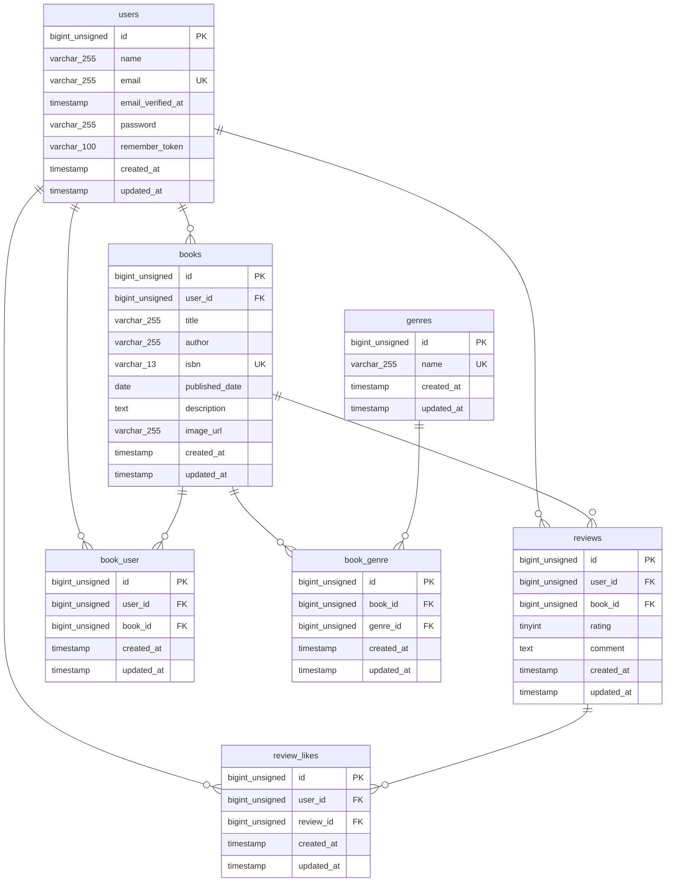

## データベース設計（ER図）

```mermaid
erDiagram
    users ||--o{ books : ""
    users ||--o{ reviews : ""
    users ||--o{ book_user : ""
    users ||--o{ review_likes : ""

    books ||--o{ reviews : ""
    books ||--o{ book_genre : ""
    books ||--o{ book_user : ""

    genres ||--o{ book_genre : ""
    reviews ||--o{ review_likes : ""

    users {
        bigint_unsigned id PK
        varchar_255 name
        varchar_255 email UK
        timestamp email_verified_at
        varchar_255 password
        varchar_100 remember_token
        timestamp created_at
        timestamp updated_at
    }

    genres {
        bigint_unsigned id PK
        varchar_255 name UK
        timestamp created_at
        timestamp updated_at
    }

    books {
        bigint_unsigned id PK
        bigint_unsigned user_id FK
        varchar_255 title
        varchar_255 author
        varchar_13 isbn UK
        date published_date
        text description
        varchar_255 image_url
        timestamp created_at
        timestamp updated_at
    }

    reviews {
        bigint_unsigned id PK
        bigint_unsigned user_id FK
        bigint_unsigned book_id FK
        tinyint rating
        text comment
        timestamp created_at
        timestamp updated_at
    }

    book_genre {
        bigint_unsigned id PK
        bigint_unsigned book_id FK
        bigint_unsigned genre_id FK
        timestamp created_at
        timestamp updated_at
    }

    book_user {
        bigint_unsigned id PK
        bigint_unsigned user_id FK
        bigint_unsigned book_id FK
        timestamp created_at
        timestamp updated_at
    }

    review_likes {
        bigint_unsigned id PK
        bigint_unsigned user_id FK
        bigint_unsigned review_id FK
        timestamp created_at
        timestamp updated_at
    }
```
